# Protosprite

A protobuf-based binary format for sprite sheets, with geometry tracing and Three.js rendering.

[Live Demo](https://brownstein.github.io/protosprite/)

## Overview

Protosprite is a monorepo containing a suite of packages for working with sprite sheets. It takes Aseprite source files and produces compact binary `.prs` (sprite data) and `.prsg` (collision geometry) files, which can be loaded and rendered in Three.js with animation, layer control, and visual effects.

## Architecture

### Stage 1: Aseprite Input

Source `.ase`/`.aseprite` files containing frames, layers, tags, and z-index overrides.

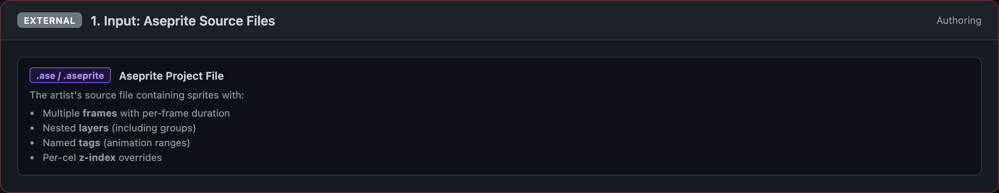

### Stage 2: Aseprite Binary Export

The CLI invokes the Aseprite binary in batch mode to produce a packed spritesheet PNG and JSON metadata.

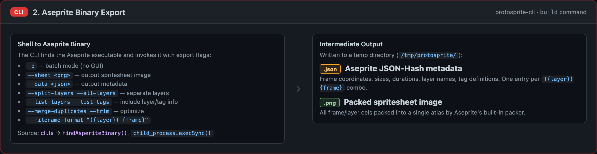

### Stage 3: Import & Data Model

`protosprite-core` parses the Aseprite JSON export and constructs the typed data model (sprites, frames, layers, animations).

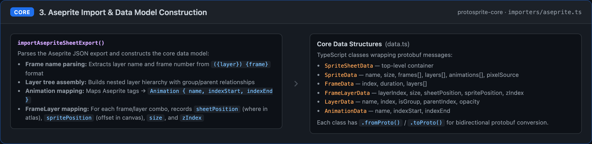

### Stage 4: Packing & Compression

Bin-packing optimizes the sprite atlas, then optional PNG compression via pngquant reduces file size.

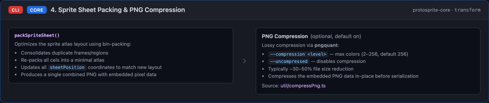

### Stage 5: Protobuf Serialization

The data model serializes to the compact `.prs` binary format via `@bufbuild/protobuf`.

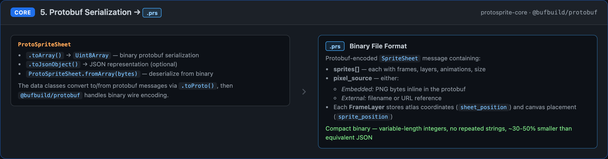

### Stage 6: Geometry Tracing

Optional geometry tracing produces `.prsg` files with collision polygons, convex decomposition, and de-duplicated vertex/shape pools.

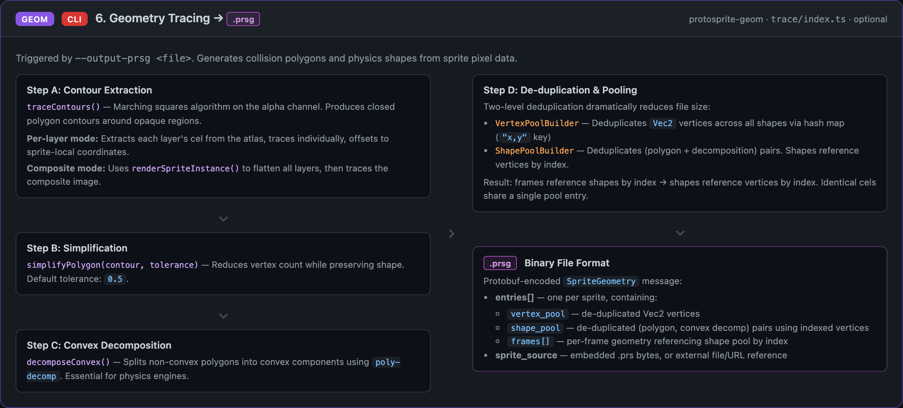

### Protobuf Schemas

The wire format definitions for `.prs` (sprite.proto) and `.prsg` (sprite_geometry.proto).

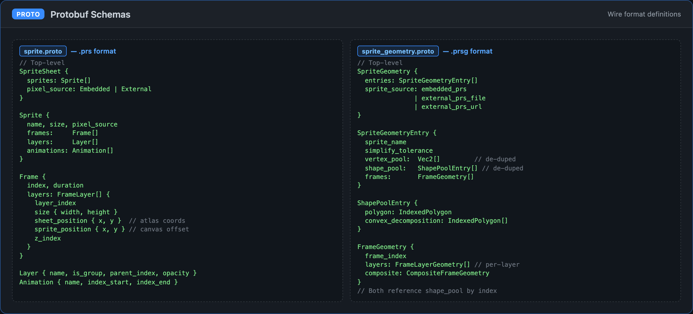

### Stage 7: Three.js Loading

`protosprite-three` loads `.prs` files, resolves pixel sources, and creates textured sprite instances.

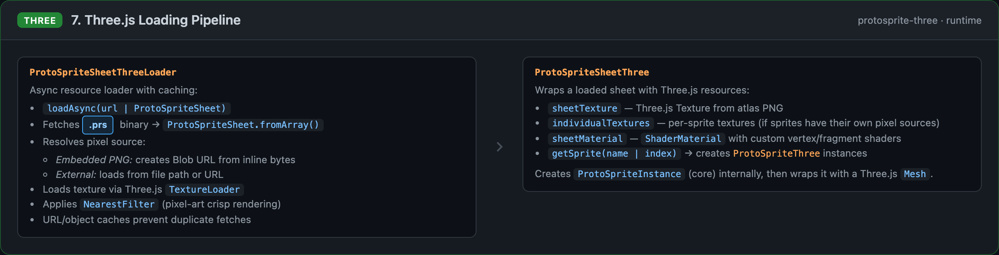

### Stage 8: Per-Frame Rendering

Each sprite is a `Mesh` with a custom shader pipeline supporting animation, layer effects, and outlines.

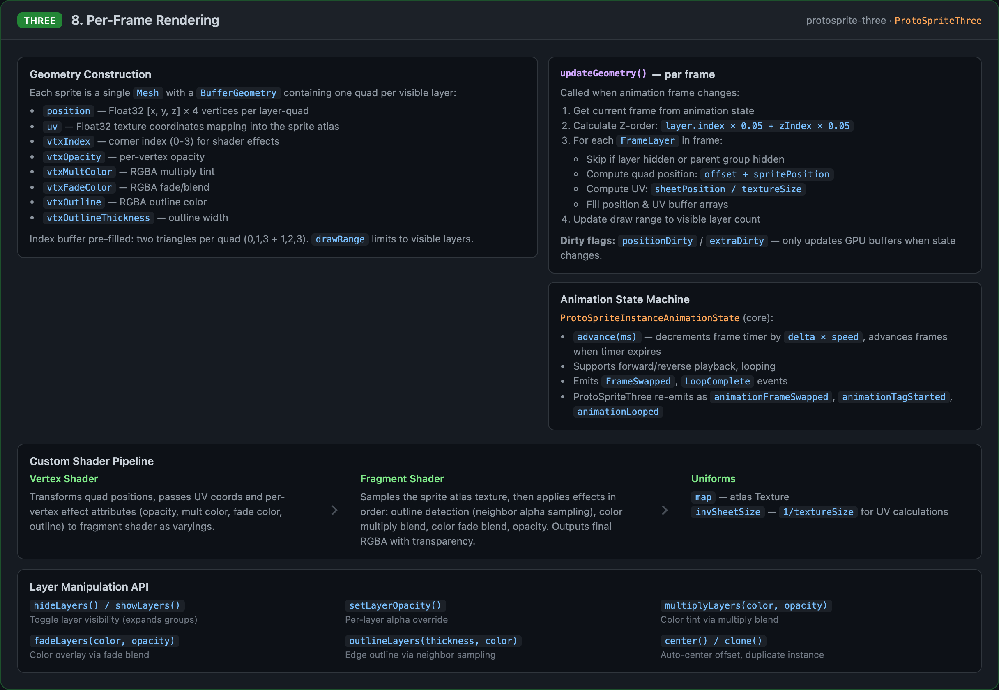

### Stage 9: Demo App

The interactive demo application built with React and Three.js.

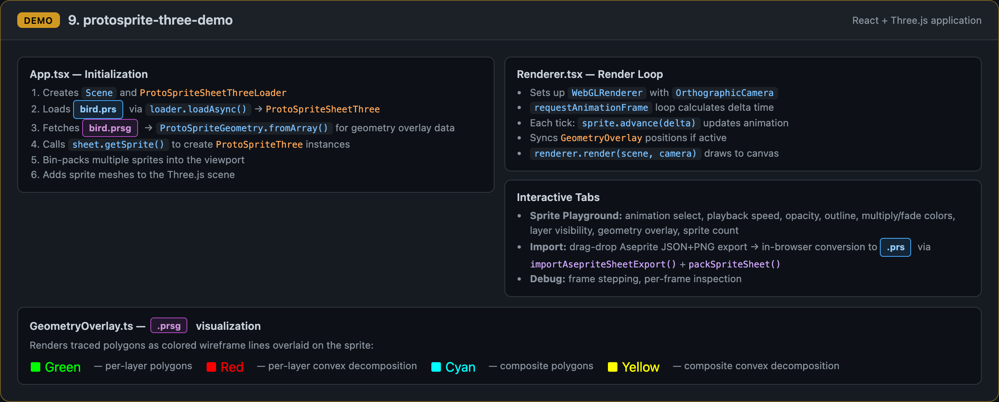

### Package Dependency Graph

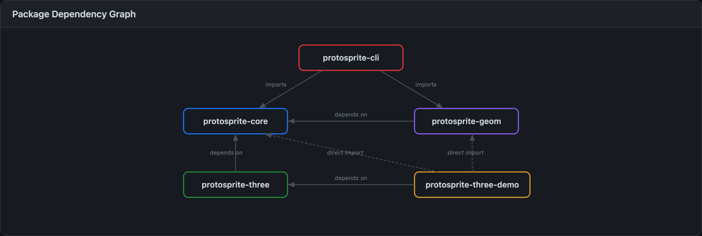

### Additional CLI Outputs

The CLI supports additional output formats including TypeScript types, preview images, frame exports, and geometry JSON.

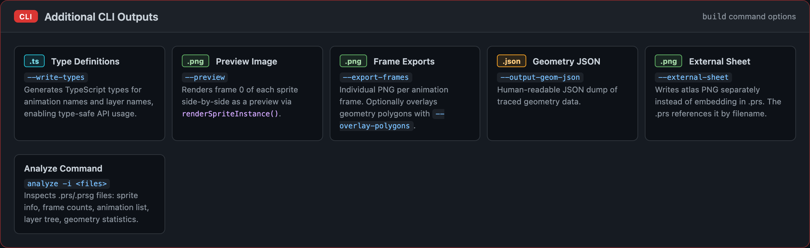

## Packages

| Package | Description |
|---------|-------------|
| [`protosprite-core`](packages/protosprite-core) | Core data model, protobuf serialization, Aseprite import, and sprite sheet packing |
| [`protosprite-geom`](packages/protosprite-geom) | Polygon geometry tracing, simplification, convex decomposition, and `.prsg` encoding |
| [`protosprite-cli`](packages/protosprite-cli) | CLI for building `.prs`/`.prsg` files from Aseprite sources |
| [`protosprite-three`](packages/protosprite-three) | Three.js loader and renderer with animation, layer effects, and custom shaders |
| [`protosprite-three-demo`](packages/protosprite-three-demo) | Interactive demo application ([live](https://brownstein.github.io/protosprite/)) |

## File Formats

### `.prs` (ProtoSprite)

Protobuf-encoded `SpriteSheet` message containing sprite metadata (frames, layers, animations) and either embedded or externally-referenced PNG atlas data. Compact binary with variable-length integers, typically 30-50% smaller than equivalent JSON.

### `.prsg` (ProtoSprite Geometry)

Protobuf-encoded `SpriteGeometry` message containing traced collision polygons with de-duplicated vertex and shape pools. Includes both per-layer and composite geometry with convex decomposition for physics engines.
